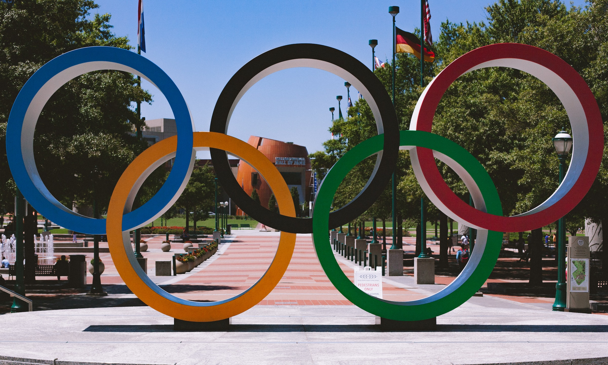

# Olympics Dataset Analysis

## Which client/dataset did you select and why?
Olympic Dataset, because I have an inclination in sports and would like to make a career out of it. Using this dataset I can create a great project that can shine in my resume and plus sports is a field which I really like

## Describe the steps you took to import and clean the data

I used Pandas library for reading the data, which is in csv file. To clean the data, first I removed the null values and merge the two dataframe based on the NOC columns.

## Perform initial exploration of data and provide some screenshots or display some stats of the data you are looking at

df.describe()
df.info()
merge two df_events and df_regions